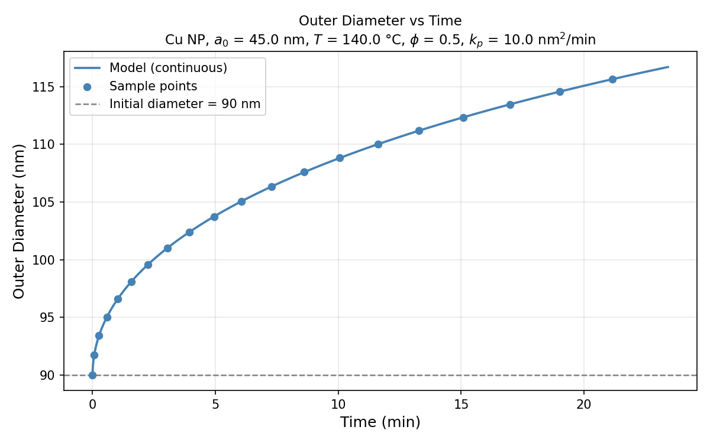
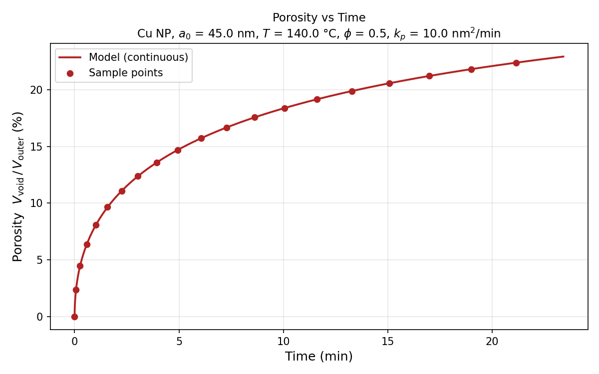

# KEGM Results

**Model:** General Kinetic Model — Susman, Vaskevich & Rubinstein, *J. Phys. Chem. C* 2016, 120, 16140–16152  
**System:** Cu nanoparticle oxidation → Cu₂O  
**Temperature:** 140.0 °C  
**Initial radius:** 45.0 nm (90 nm diameter)  

---

## 1. Computed Model Parameters

| Parameter | Symbol | Value |
|---|---|---|
| Pilling–Bedworth ratio | Z | 1.6812 |
| Core-contraction parameter | phi | 0.5 |
| Growth rate ratio | K | 2.3624 |
| Outward rate constant | k_out | 7.0259 nm2/min |
| Inward rate constant | k_in | 2.9741 nm2/min |
| Parabolic rate constant (input) | k_p | 10.0000 nm2/min |
| phi self-consistency check Z/(1+K) | — | 0.500000 |
| k_p check (k_in + k_out) | — | 10.000000 nm2/min |
| Vacancy flow direction | — | inward (NKE active — internal void forms) |

**Self-consistency:** phi PASS  |  k_p PASS

---

## 2. Verification Against Case Study

Computed values at reference conversion fractions. Compare with Section 8.2 of `Susman_KE_GeneralModel.md`.

| delta | g(delta) | t (min) | a1 (nm) | a2 (nm) | a_v_int (nm) | Outer diameter (nm) | Porosity (%) |
|---|---|---|---|---|---|---|---|
| 0.0 | 0.00000 | 0.00 | 45.00 | 45.00 | 0.00 | 90.00 | 0.00 |
| 0.1 | 0.00091 | 0.26 | 44.24 | 46.71 | 16.58 | 93.41 | 4.47 |
| 0.2 | 0.00355 | 1.02 | 43.45 | 48.30 | 20.89 | 96.59 | 8.09 |
| 0.4 | 0.01365 | 3.93 | 41.77 | 51.20 | 26.32 | 102.39 | 13.58 |
| 0.6 | 0.02992 | 8.62 | 39.96 | 53.80 | 30.12 | 107.60 | 17.56 |
| 0.8 | 0.05236 | 15.09 | 37.95 | 56.17 | 33.16 | 112.34 | 20.57 |
| 1.0 | 0.08123 | 23.41 | 35.73 | 58.35 | 35.70 | 116.70 | 22.91 |

## 3. Key Milestones

| Milestone | delta | t (min) | Outer diameter (nm) | Porosity (%) |
|---|---|---|---|---|
| Start (unreacted) | 0.000 | 0.00 | 90.00 | 0.00 |
| ~40% conversion (LSPR max) | 0.400 | 3.93 | 102.38 | 13.58 |
| Near full conversion | 0.999 | 23.41 | 116.70 | 22.91 |

---

## 4. Plots

### Outer Diameter vs Time

The particle expands as Cu is consumed and Cu2O (Z = 1.68) grows outward. The outer diameter increases monotonically from the initial 90 nm.

### Porosity vs Time

Porosity = V_void / V_outer = (a_v_int / a2)^3. Starts at 0 and increases as inward vacancy flow hollows the core (phi = 0.5 < Z/2 = 0.84).

